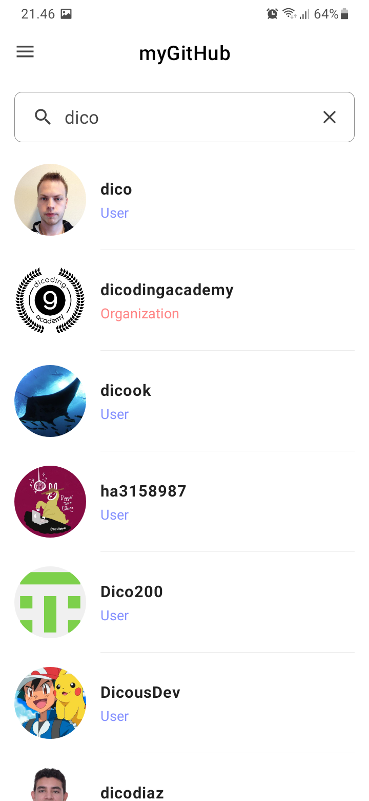

# MyGithub
The first and the second submission on Belajar Fundamental Aplikasi Android (BFAA) class Dicoding Academy | Bangkit 2023

> **Warning**
> IF YOU ARE DOING ON THE SAME SUBMISSION, PLEASE USE THIS AS A REFERENCE. PLEASE DON'T COPY PASTE!

## The first (1st) submission screenshots :
<table>
   <tr>
      <td></td>
      <td></td>
      <td></td>
   </tr> 
   <tr>
      <td></td>
      <td></td>
      <td></td>
  </tr>
  <tr>
      <td></td>
  </tr>
</table>
